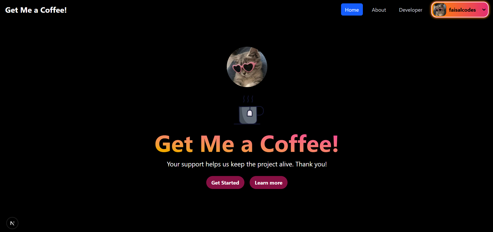
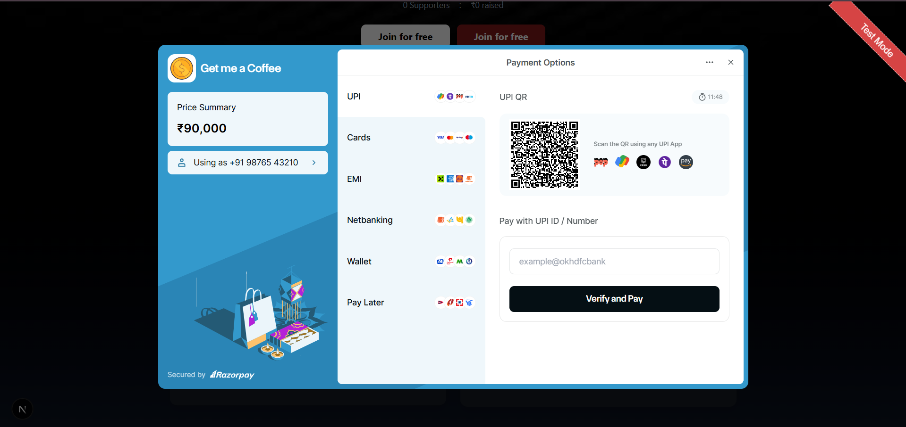
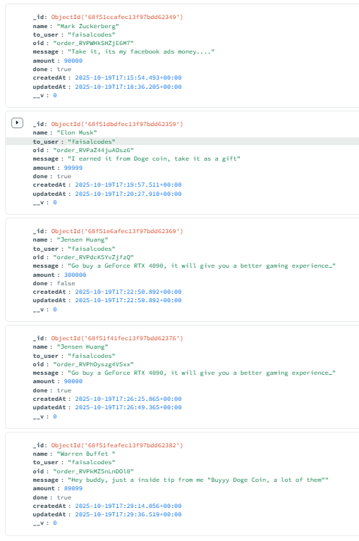
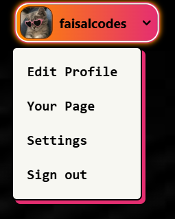
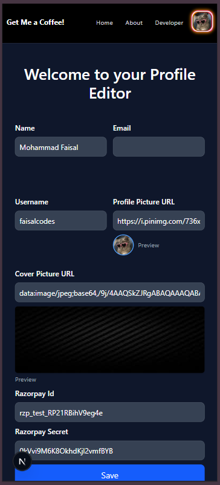
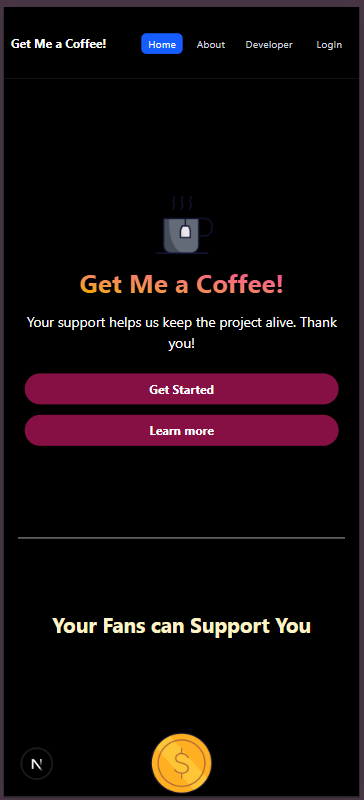
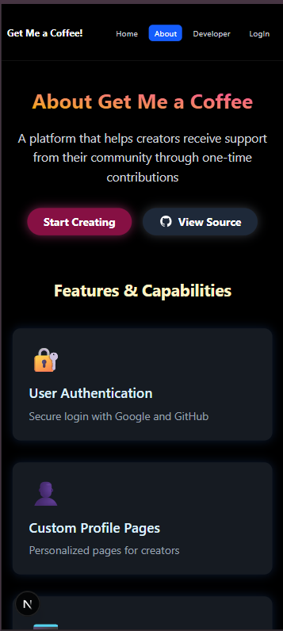
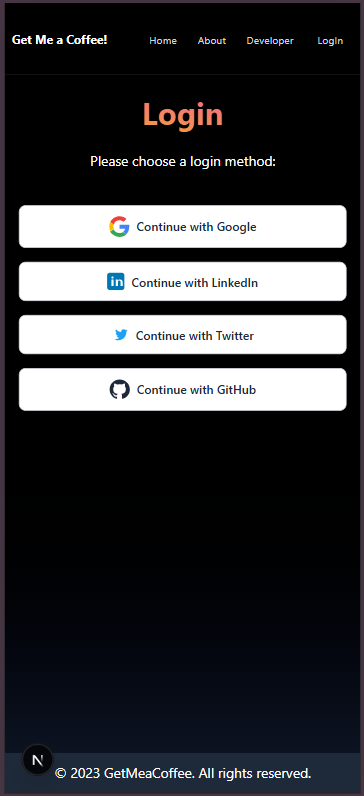

# Get Me a Coffee

A sophisticated creator monetization platform that enables seamless connections between content creators and their supporters. Built with modern web technologies, it demonstrates advanced implementation of authentication systems, payment gateway integration, and real-time data management.

---

## 📸 Screenshots

### Desktop Views

<div align="center">
  
</div>

<div align="center">
  
</div>

<div align="center">
  
</div>

<div align="center">
  
 
</div>


<div align="center">
  
</div>

### Mobile Views

<div align="center">
 
  
</div>

<div align="center">
  
  
</div>


---

## 🛠️ Current Features

### Authentication & Security

- **GitHub Authentication**: Secure login implementation using NextAuth.js
- **Protected Routes**: Basic access control for user pages
- **Session Management**: Secure session handling with NextAuth.js

### Creator Features

- **Custom Profile Pages**: Basic personalized pages for creators
- **Profile Customization**: Upload and update profile/cover pictures
- **Payment Integration**: Basic Razorpay payment gateway integration
- **Simple Analytics**: View supporter count and total earnings
- **Payment Notifications**: Basic payment success notifications

### Supporter Features

- **Easy Payment Flow**: Quick and secure payment process
- **Message Support**: Leave personalized messages with contributions
- **Transaction History**: Track your support history

### Technical Features

- **Responsive Design**: Optimized for all devices
- **Server-side Rendering**: Enhanced performance with Next.js
- **Real-time Updates**: Instant transaction notifications
- **Secure Data Handling**: MongoDB with Mongoose for data management

---

## 🚀 Future Development Roadmap

### Enhanced Authentication

- Integration with multiple OAuth providers (Google, LinkedIn, Twitter)
- Two-factor authentication (2FA)
- Email verification system
- Password recovery system

### Advanced Analytics Dashboard

- Detailed earnings analytics
- Supporter demographics
- Payment trends and patterns
- Custom date range reports
- Export functionality for data

### Supporter Features

- Creator discovery system
- Favorite creators list
- Recurring payment options
- Support history dashboard
- Custom notification preferences

### Creator Features

- Advanced profile customization
- Multiple payment gateway options
- Custom landing page themes
- Automated payout scheduling
- Marketing tools integration

### Platform Enhancements

- Advanced search functionality
- Category-based creator discovery
- Creator verification system
- Community features and interactions
- API access for integrations

---

## 🔧 Technical Implementation

### Core Technologies

| Layer            | Technology             | Purpose                                     |
| ---------------- | ---------------------- | ------------------------------------------- |
| Frontend         | Next.js 13, React      | Modern web framework with server components |
| Styling          | TailwindCSS            | Utility-first CSS for responsive design     |
| Authentication   | NextAuth.js            | Multi-provider auth with session management |
| Database         | MongoDB with Mongoose  | Scalable NoSQL database with ODM            |
| Payment Gateway  | Razorpay               | Secure payment processing                   |
| State Management | React Hooks & Context  | Efficient client-side state handling        |
| API Layer        | Next.js Server Actions | Secure server-side operations               |

### Current Implementations

- **Authentication**: Basic GitHub OAuth integration with NextAuth.js
- **Database Schema**: MongoDB schemas for users and payments
- **Payment Processing**: Basic Razorpay payment integration
- **Notifications**: Simple payment success notifications
- **API Security**: Basic route protection with NextAuth
- **Responsive Design**: Mobile-friendly layout with Tailwind CSS
- **Performance**: Next.js server-side rendering implementation

---

## 🚀 Installation / Setup

1. Clone the repository

   ```bash
   git clone https://github.com/faisalzGIT/get-me-a-coffee-cloned.git
   cd get-me-a-coffee-cloned
   ```

2. Install dependencies

   ```bash
   npm install
   ```

3. Set up environment variables  
   Create a `.env.local` file with:

   ```
   NEXTAUTH_URL=http://localhost:3000
   NEXTAUTH_SECRET=your_nextauth_secret
   GOOGLE_ID=your_google_client_id
   GOOGLE_SECRET=your_google_client_secret
   GITHUB_ID=your_github_client_id
   GITHUB_SECRET=your_github_client_secret
   MONGODB_URI=your_mongodb_uri
   RAZORPAY_KEY_ID=your_razorpay_key_id
   RAZORPAY_SECRET=your_razorpay_secret
   ```

4. Run the development server

   ```bash
   npm run dev
   ```

5. Open in browser at `http://localhost:3000`

---

## 💻 Usage

### For Supporters:

- Visit a creator's profile
- Choose amount to contribute
- Complete secure payment
- Leave message

### For Creators:

- Sign up using Google/GitHub
- Set up your profile
- Customize profile/cover images
- Add Razorpay credentials
- Share your unique page
- Track supporters and earnings

---

## 🛡️ Security Implementation

### Current Security Features

- **OAuth Authentication**: GitHub authentication via NextAuth.js
- **Session Management**: Built-in NextAuth.js session handling
- **Route Protection**: Basic protected routes implementation
- **Payment Security**: Standard Razorpay security features
- **Input Validation**: Basic form validation

### Future Security Enhancements (Planned)

- Additional OAuth providers (Google, LinkedIn, Twitter)
- Enhanced input validation and sanitization
- Rate limiting implementation
- Advanced error handling and logging
- Two-factor authentication (2FA)

---

## ⚡ Performance Optimization

### Frontend Optimization

- **Server Components**: Next.js 13 server component architecture
- **Code Splitting**: Automatic chunk optimization
- **Image Optimization**: Next.js Image component with lazy loading
- **CSS Optimization**: Tailwind's JIT compiler
- **Client-side Caching**: Efficient data caching

### Backend Optimization

- **Database Indexing**: Optimized MongoDB queries
- **Connection Pooling**: Efficient database connections
- **API Response Caching**: Reduced server load
- **Efficient Data Fetching**: Optimized server actions
- **Load Balancing Ready**: Scalable architecture

### Monitoring & Analytics

- **Performance Metrics**: Page load time optimization
- **Error Tracking**: Comprehensive error logging
- **User Analytics**: Behavior tracking capability
- **Payment Monitoring**: Transaction success tracking
- **Security Monitoring**: Auth attempt logging

---

## 🧑‍💻 Author

**Mohammad Faisal**  
GitHub: [faisalzGIT](https://github.com/faisalzGIT)  
Portfolio: [faisalzportfolio.netlify.app](https://faisalzportfolio.netlify.app/)

---
